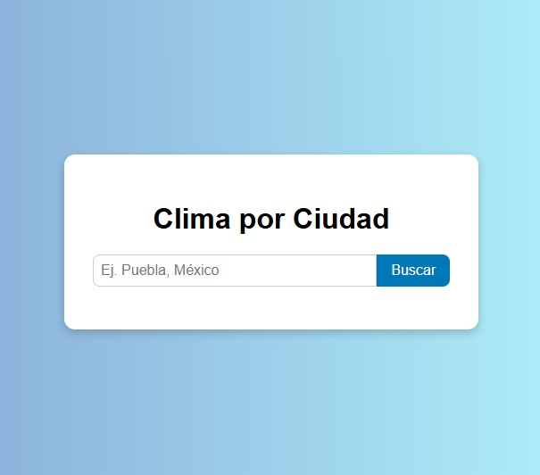
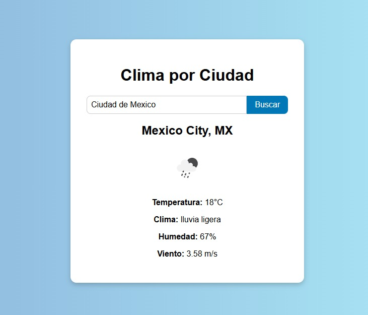

# 🌤️ Mini Dashboard Meteorológico Interactivo

Aplicación web que permite consultar el clima actual de una ciudad específica, usando la API de OpenWeatherMap.

## Tecnologías usadas

- HTML
- CSS
- JavaScript (Vanilla)
- Node.js (Express)
- [OpenWeatherMap API](https://openweathermap.org/api)

## 🚀 ¿Cómo usarlo (de manera local)?

### 🔧 Usar backend con Node.js

1. Clona este repositorio.
2. Abre una terminal en la carpeta del proyecto.
3. Ejecuta `npm install` para instalar dependencias.
4. Modifica `.env` en la carpeta `backend` con tu API key de OpenWeatherMap: API_KEY = tu_api_key_aqui
5. Ejecutar el backend con: node backend/server.js
6. Abrir `index.html` en tu navegador y la app consumirá el backend para obtener los datos.
7. Ingresa el nombre de una ciudad y presiona "Buscar".

## 💻 Despliegue en producción

El backend está desplegado en Render:
https://mini-dashboard-meteorologico-interactivo-0rzh.onrender.com

El frontend está desplegado en Vercel  (interfaz visual):
https://mini-dashboard-meteorologico-intera.vercel.app/

## 📸 Captura de pantalla

## Vista de la interfaz principal

## Resultado de búsqueda del clima

## 🤖 Uso del asistente de IA en el desarrollo

Durante el desarrollo, se utilizó un asistente de inteligencia artificial (ChatGPT y  GitHub Copilot) para los siguientes fines:

GitHub Copilot fue utilizado para:
✅ Autocompletar funciones repetitivas en JavaScript y sugerencias de código durante la creación del frontend y backend.

ChatGPT fue empleado para:
✅ Generación del boilerplate base del frontend.

✅ Asistencia en la configuración de variables de entorno para proteger la API key.

✅Elaboración de la llamada a la API de OpenWeather, con manejo adecuado de parámetros y errores.

✅Desarrollo y corrección del código frontend para realizar peticiones al backend en lugar de directamente a la API pública.

✅Orientación para el despliegue del backend en Render y del frontend en Vercel.

✅Creación y estructuración del archivo README para documentar el proyecto y facilitar su uso.

Gracias al asistente de IA, pude acelerar el desarrollo, evitar errores comunes y obtener buenas prácticas para el proyecto.

## Autor

Omar Altamirano Canepa
📧 Contacto: omaraltamirano245@outlook.com

