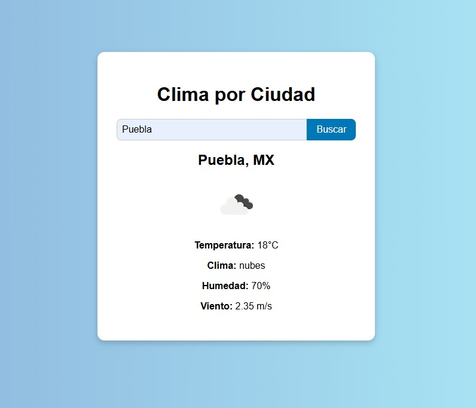

# 🌤️ Mini Dashboard Meteorológico Interactivo

Aplicación web que permite consultar el clima actual de una ciudad específica, usando la API de OpenWeatherMap.

## Tecnologías usadas

- HTML
- CSS
- JavaScript (Vanilla)
- Node.js (Express)
- [OpenWeatherMap API](https://openweathermap.org/api)

## 🚀 ¿Cómo usarlo?

### 💻 Opción 1: Usar solo el frontend estático

1. Clona este repositorio o descarga los archivos.
2. Abrir `index.html` en tu navegador.
3. Ingresa una ciudad y haz clic en "Buscar".

---

### 🔧 Opción 2: Usar backend con Node.js

1. Clona este repositorio.
2. Abre una terminal en la carpeta del proyecto.
3. Ejecuta `npm install` para instalar dependencias.
4. Crear un archivo `.env` en la carpeta `backend` con tu API key de OpenWeatherMap: API_KEY = tu_api_key_aqui
5. Ejecutar el backend con: node backend/server.js
6. Abrir `index.html` en tu navegador y la app consumirá el backend para obtener los datos.

## 📸 Captura de pantalla

## Vista de la interfaz principal

## Resultado de búsqueda del clima

## Autor

Omar Altamirano Canepa
📧 Contacto: omaraltamirano245@outlook.com
